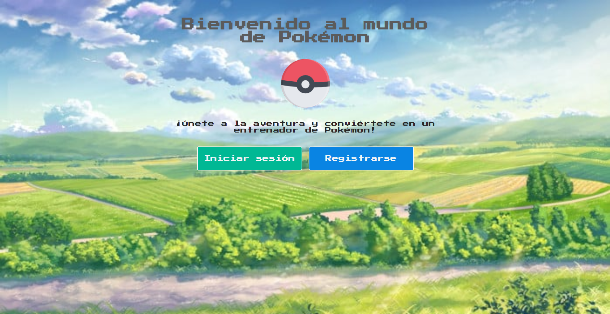

# POKEMON FAVORITES - CERTUS
## Integrantes
- Astucuri Barrial Jhon Jhonatan
- Bellido Vargas Jhon Brishman
- Cabrejos Garcia Giancarlo 
- Sanchez Chavez Javier Francisco
- Zambrano Marrufo Kevin Jhoel

### Explicacion sobre el Proyecto planteado

La presente aplicacion denominada ProyectoPokemon,(151 pokemons de la primera generacion que pueden ser seleccionados)
-  Inicia el el Index, donde se aprecia una bienvenida y dos botones con las opciones "Iniciar Sesion" o "Registrarse".
- Al seleccionar la opcion registro se le pedira llenar los siguientes campos:
    - Nombre completo:cowboy_hat_face:
    - Correo electronico:e-mail:
    - Usuario:adult:
    - Contraseña:lock_with_ink_pen:
    - Confirmacion de la Contraseña:closed_lock_with_key:
- Una vez registrado se le redirigira a la ventana de pokemon_list, donde podra seleccionar sus pokemons favoritos.
- Una vez seleccionado sus pokemons favoritos puede pasar a la pagina Pokemon_Favoritos donde podra visualizar los pokemon antes seleccionados.
- En la ventana de profile podra obvervar los siguientes campos:
    - Nombre completo:cowboy_hat_face:
    - Correo electronico:e-mail:
    - Usuario:adult:
    - Contraseña:lock_with_ink_pen:
    - Confirmacion de la Contraseña:closed_lock_with_key:
    
    - Estos campos estan deshabilitados, por lo cual debera pulsar en la opcion desbloquear campos para poder editar su perfil.
    - Una vez editado su perfil podra visualizar los cambio en el instante.
    - Asi mismo contiene un boton salir que cerrara la sesion del usuario.

 
El estado del proyecto, que es particularmente importante si el proyecto está todavía en desarrollo. 
En él se mencionan los cambios planeados y la dirección de desarrollo del proyecto, y se especifica directamente si un proyecto está terminado.

- El proyecto actualmente tiene un estado funcional, 

Los requisitos del entorno de desarrollo para la integración.

- Para el desarrolo del Proyecto se utilizo el entorno de trabajo que provee VisualStudioCode,
asi como MongoDB.

Una guía para la instalación y el funcionamiento.
- Para la Instalacion del proyecto basta con clonar el proyecto del la web GitHub.

Una lista de las tecnologías utilizadas y, cuando proceda, enlaces con más información.

- En la elaboracion del proyecto se uso:
    - Lenguaje HTML para la estrucctura de la aplicacion web.
    - Estilos CSS para el diseño de la aplicacion.
    - Lenjuage Java Script para la parte logica y funcinalidad de la aplicacion web.
    - MongoDB como gestor de base de datos.
    - NodeJS como entorno de servidor.
    - Se utilizo el formato de texto Json para el intercambio de datos.

Los proyectos de código abierto que se pueden modificar o desarrollar deben incluir una sección de colaboración deseada en el archivo readme.md: ¿cómo se solucionan los problemas? ¿Cómo deberían los desarrolladores impulsar los cambios?
Bugs conocidos y posibles correcciones de errores.
- Los errores que se presentaron a la hora de desarrollar el proyecto, fueron:
    - Redireccion de las ventanas.
    - Quitar pokemon de la lista de favoritos.
    - Fondos de pantalla que desaparecieron.

Información sobre derechos de autor y licencias.

